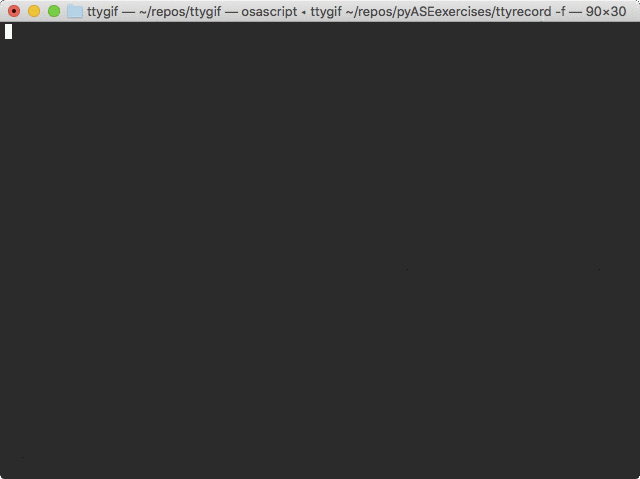

# Exercise 2

_Goal:_ Create an HTTP POST request which posts your name and a message. 

Our web application expects a [JSON](https://www.json.org/) payload which, minimally, should include a 'name' and a 'message' property. A valid response from the webserver will echo your request payload back in the HTTP response body.

```json
{
    "name": "kevin",
    "message": "this is an example POST"
}
```

Recall the various data types in Python. Here is a mapping of Python data types to [JSON object types](https://www.json.org/).


| Python           | JSON   |
|------------------|--------|
| dict	           | object |
| list, tuple	   | array  |
| str	           | string |
| int, long, float | number |
| True	           | true   |
| False	           | false  |
| None	           | null   |

What Python data type is your request payload (and a successful response body)?

```python
#Do a GIF of this.
data = {
    "president": {
        "name": "Zaphod Beeblebrox",
        "species": "Betelgeusian"
    }
}
deSerialData = json.dump(data)
type(deSerialData)
```

```python
>>> payload = {'key1': 'value1', 'key2': 'value2'}

>>> r = requests.post("https://httpbin.org/post", data=payload)
>>> print(r.text)
{
  ...
  "form": {
    "key2": "value2",
    "key1": "value1"
  },
  ...
}
```
show that 'payload' is not quite JSON (although it looks alot like that)


<details><summary>Interactive Solution</summary>
<p>


      
</p>
</details>

